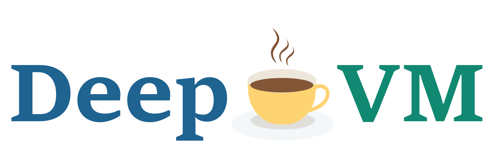

## DeepVM

### A Brief Introduction of DeepVM



DeepVM is a virtual machine, as the backend of DeepLang, a new language for IoT device.

Our goal is to make the WebAssembly IR run on the virtual machine.

At present, our project is still in the initial stage of development. We support a limited set of introductions, including addition, subtraction, multiplication and division, etc.

In the future, we will support more instructions according to the needs of the DeepLang.

### How to build?

##### Prepare

we need to setup some tools include gcc, gdb, cmake, make.

If your OS is windows and the environment is msys2,  please do it as follow:

```shell
pacman -S gcc gdb cmake make
```

| Packages | Version        |
| -------- | -------------- |
| cmake    | cmake-3.20.1-1 |
| gcc      | gcc-10.2.0-1   |
| gdb      | gdb-9.2-3      |
| make     | make-4.3-1     |

If your OS is MacOS , please do it as follow:

```shell

```

If your OS is linux such as ubuntu, please do it as follow:

```

```

##### Build deepvm

Current is project root .

```shell
mkdir build
cd build
cmake ..
make
```

##### Run deepvm

Current is build path.

```shell
../bin/deepvm.exe ../example/example.wasm
```

##### Debug deepvm

```
gdb ../bin/deepvm.exe
r ../example/example.wasm
```

some useful debug commands:

| Command  | Abbreviation |    Use     |
| :------: | :----------: | :--------: |
|  break   |      b       | break main |
| continue |      c       |            |
|   step   |      s       |            |
|   next   |      n       |            |
|  print   |      p       | print name |

