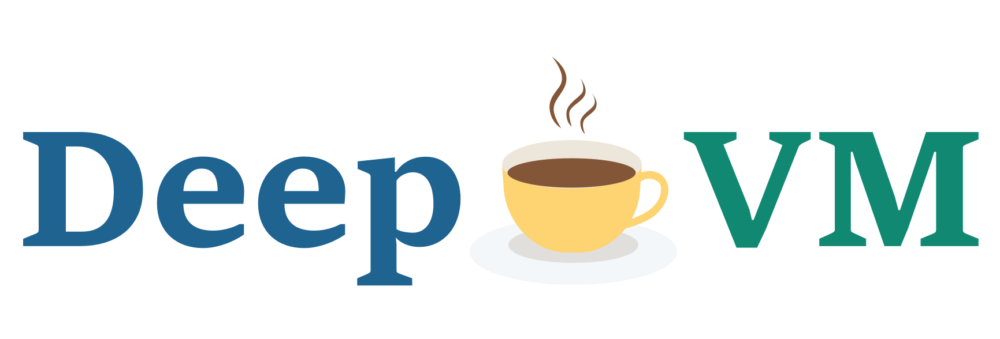

<div align="center">
  
  <h1>DeepVM</h1>
  <p>
    
    
    
    
    
    
    
  </p>
</div>

DeepVM 是一个用 C 语言编写的 **WebAssembly 1.0（MVP）** 解释器，也是
[Deeplang](https://github.com/deeplang-org)（面向 IoT 设备的新型编程语言）的后端执行引擎。

它既能**解释执行** `.wasm` 二进制字节码，也能把 **WAT（S 表达式）文本汇编成 `.wasm`**，
二者共享同一套 loader 与解释器，保证「写了就一定能跑」。

## 特性

- **完整的 WebAssembly 1.0（MVP）指令集**：覆盖数值运算、比较、转换、内存、控制流、
  变量、函数调用等全部 MVP 指令（见 [include/deep_opcode.h](include/deep_opcode.h)）。
- **WAT → WASM 汇编器**：支持折叠写法与平铺写法两种 S 表达式语法，可按扩展名自动识别
  并生成 `.wasm` 二进制（见 [src/deep_wat.c](src/deep_wat.c)）。
- **标准二进制格式加载**：解析 Type / Import / Func / Table / Memory / Global / Export /
  Start / Elem / Code / Data 全部 11 个 section（见 [src/deep_loader.c](src/deep_loader.c)）。
- **内置原生函数**：`puts` / `puti` / `putf` / `putl` / `putd` / `isinff` / `isnanf` /
  `isinfd` / `isnand`，方便在解释器中直接输出与做浮点判断。
- **符号化调试**：指令日志、操作数栈与内存追踪（见 [src/deep_log.c](src/deep_log.c)）。
- **跨平台**：Linux / Windows 均可构建（见 [doc/deepvm_wasm_linux.md](doc/deepvm_wasm_linux.md)、
  [doc/deepvm_windows.md](doc/deepvm_windows.md)）。

## 构建

```shell
cmake -S . -B build
cmake --build build
```

产物为 `bin/deepvm`（Windows 下为 `bin/deepvm.exe`）。

## 使用

```text
deepvm <file.wasm>            # 解释执行 wasm 二进制，打印 main 的返回值
deepvm <file.wat>             # 自动把 WAT 汇编为同名 .wasm 并落盘
deepvm -o out.wasm <file.wat> # 汇编到指定输出文件
deepvm --version | -v         # 打印版本信息
```

> 程序通过 export section 中名为 `main` 的函数作为入口，并将返回值以
> `printf("%ld", ans)` 输出，因此 `main` 应返回 `i32`/`i64` 类型。

一个 WAT 例子（`examples/` 可参考 [test/](test/) 中的用例）：

```wat
(module
  (import "env" "puti" (func $puti (param i32) (result i32)))
  (func (export "main") (result i32)
    (i32.mul (i32.const 6) (i32.const 7))))   ;; 42
```

## 测试

```shell
cd test
python3 test.py
```

测试套件按 WebAssembly 1.0 的 section 组织，每个 `.wasm` 用例都有一个一一对应的 `.wat`
（同名不同扩展名），`test.py` 会先直接运行 `.wasm`，再把 `.wat` 汇编成临时 `.wasm`
运行，断言两次输出一致，从而同时验证 loader、解释器与 WAT 汇编器。

| 目录        | 覆盖内容                                                  |
| ----------- | --------------------------------------------------------- |
| `math/`     | i32/i64/f32/f64 算术、比较、转换                           |
| `shift/`    | 移位与循环移位（`shl`/`shr_s`/`shr_u`/`rotl`/`rotr`）       |
| `memory/`   | 窄宽度 load/store、`memory.size`、`memory.grow`             |
| `global/`   | Global section、`global.get`/`global.set`                  |
| `table/`    | Table/Elem section、`call_indirect`                        |
| `start/`    | Start section                                              |
| `control/`  | `block`/`loop`/`if`/`br`/`br_if`/`br_table`/`select`        |
| `builtin/`  | 内置原生函数的 import 调用                                   |
| `combine/`  | 组合多特性的端到端用例（函数、控制流、内存、全局、表、start、内置函数等） |

当前共 **187 个 `.wasm` + 187 个 `.wat`（374 个用例）**。

## 项目结构

```text
deepvm/
├── include/          # 头文件（opcode、loader、interp、wat、version 等）
├── src/              # 源码（main、loader、interp、wat、mem、log、opcode、version）
├── test/             # 测试套件与用例（见上表）
├── doc/              # 设计与使用文档（见下表）
├── build/            # CMake 构建目录
├── bin/              # 可执行文件输出目录
└── CMakeLists.txt
```

## 文档

| 文档                                        | 内容                                   |
| ------------------------------------------- | -------------------------------------- |
| [doc/interp.md](doc/interp.md)              | 解释器设计                             |
| [doc/flow_control.md](doc/flow_control.md)  | 控制流指令实现                         |
| [doc/deep_loader.md](doc/deep_loader.md)    | wasm 二进制加载器                      |
| [doc/deepvm_builtin_api.md](doc/deepvm_builtin_api.md) | 内置原生函数 API               |
| [doc/deepvm_wasm_sections.md](doc/deepvm_wasm_sections.md) | wasm section 格式说明      |
| [doc/deepvm_wasm_linux.md](doc/deepvm_wasm_linux.md) | Linux 构建/使用说明           |
| [doc/deepvm_windows.md](doc/deepvm_windows.md) | Windows 构建/使用说明               |

## License

本项目采用 [MIT License](LICENSE)。
