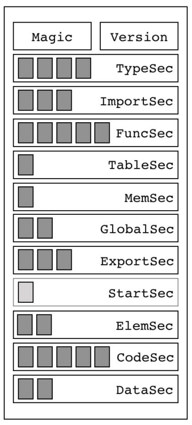

## deepvm wasm sections

wasm二进制格式总体结构。12个段（section），包括类型段、导入段、函数段、表段、内存段、全局段、导出段、起始段、元素段、代码段、数据段。

deepvm采用的是wasm 1.0，最新的是1.1，多了一个数据计数段。

deepvm主要由loader、interp、deepmen、deeplog等组成。

- loader:加载 section；
- interp:解释执行；

### 类型段

段ID是1。该段列出Wasm模块用到的所有函数类型（又叫作**函数签名**，或者函数原型）。

### 导入段和导出段

略。在deepvm中，导入段主要是用于builtin api和FFI设计。暂时不支持导出段。

### 函数段和代码段

段ID是3和10。

内部函数信息被分开存储在两个段中：

- 其中 函数段实际上是一个索引表，列出内部函数所对 应的签名索引；
- 代码段存储内部函数的局部变量 信息和字节码；

代码段，call（直接和间接）调用函数，流程控制的opcode。

### 表段和元素段

段ID是4和9。

表段列出模块内定义的所有表，元素段列出表初始化数据。Wasm规范规定模块最多只能导入或定义一张表，所以即使模块有表段，里面也只能有一个项目。

deepvm暂时不支持这些；

### 内存段和数据段

段ID是5和11。

内存段列出模块内定义的所有内存，数据段列出内存初始化数据。Wasm规范规定模块最多只能导入或定义一块内存，所以即使模块有内存段，里面也只能有一个项目。

### 全局段

段ID是6。

该段列出模块内定义的所有全局变量信息，包括值类型、可变性（Mutability）和初始值。

### 起始段

段ID是8。

起始函数主要起到两个作用：

- 一个是在模块加载后进行一些初始化工作；
- 另一个是把模块变成可执行程序。

deepvm主要参考intel的micro wasm runtime项目，用main函数作为entry，暂时不支持起始段。

### 自定义段

段ID是0。

该段是给编译器等工具使用的，里面可以存放函数名等调试信息，或者其他任何附加信息。自定义段不参与Wasm语义，所以即便是完全忽略自定义段也不影响模块的执行。

### 后端特性

跟前端对接的时候需要考虑：

1、后端有函数签名的表，函数的表，但是函数的入参和返回值，支持数据类型（int float），不支持struct、record这些高级类型；

2、函数body在代码段；

3、如何生成wasm的section，用wabt，在codegen的时候要考虑这个；

4、全局变量对应全局段；

5、间接调用函数，需要设计表段和元素段；
